# University Website
Website that allows students to view the available courses, view course information, search for a specific course or professor.

## Database
Using MySQL and phpMyAdmin.

  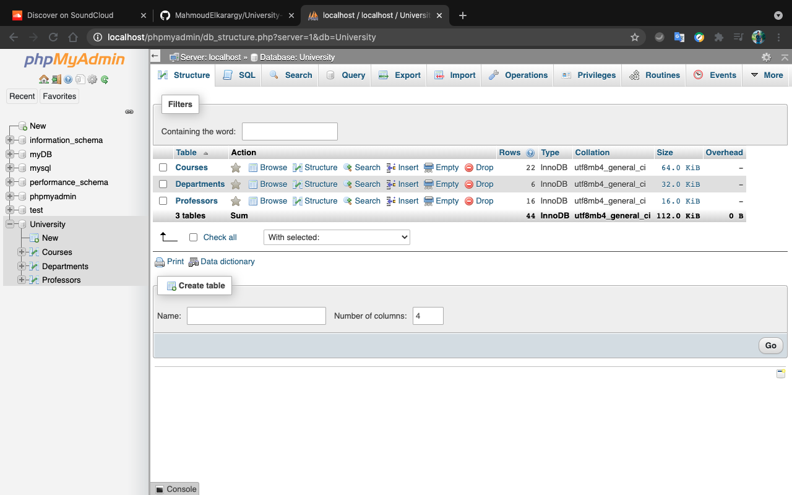
  
Consists of 3 tables: Courses, Departments and Professors.

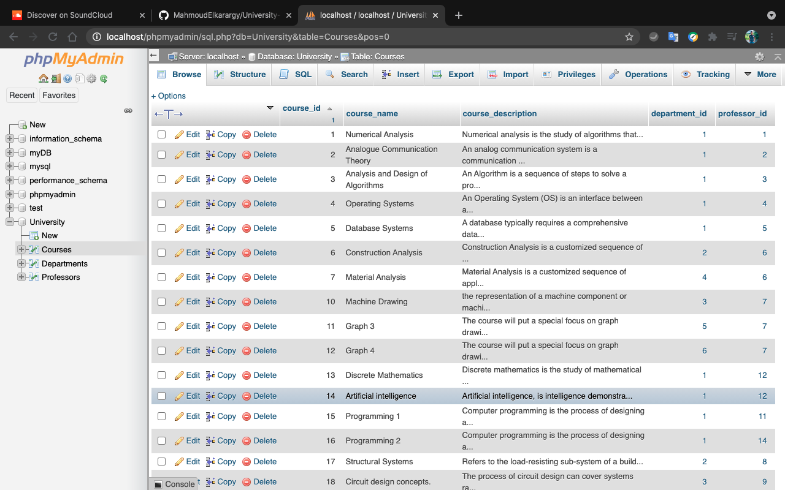
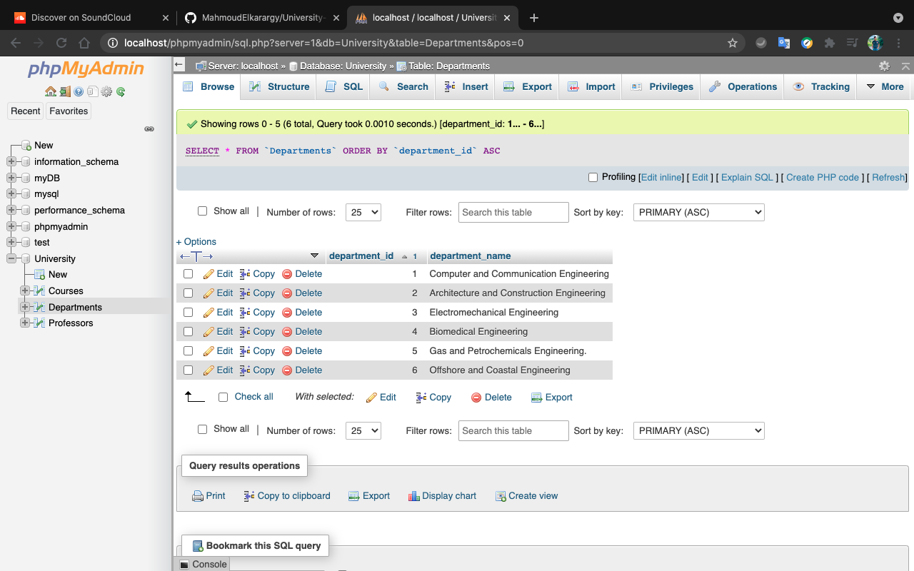

Some of the content in the Courses and Departments Table.

## Home Page
### Image slider

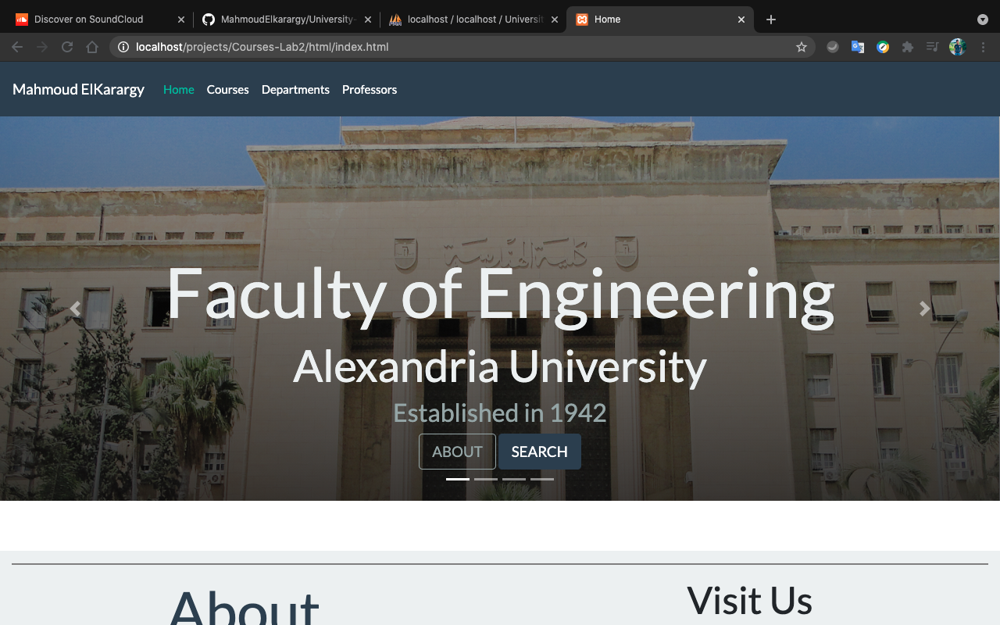
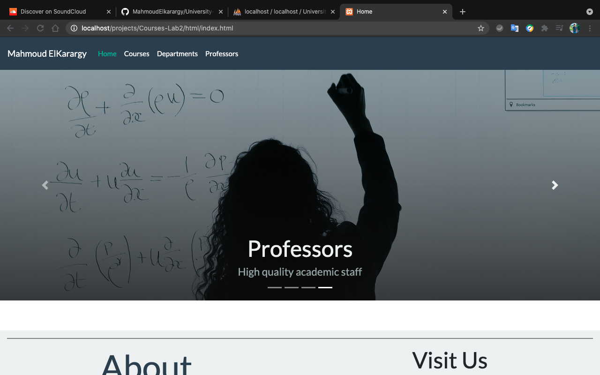

Part of the image slider.

### Info

  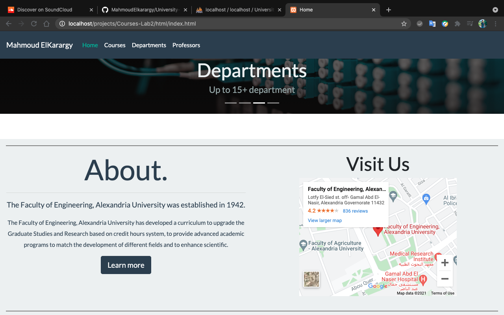
  
Info Description and map location.

### Footer

  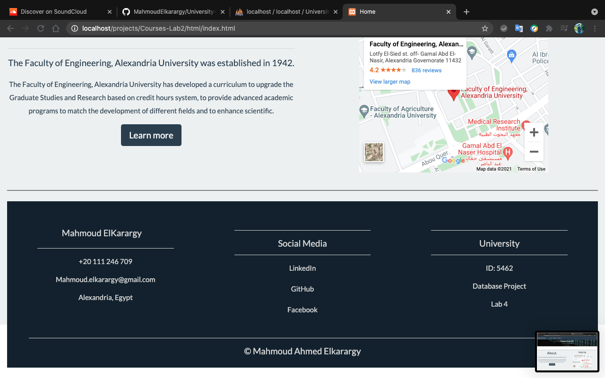

## Courses
### Pagination

  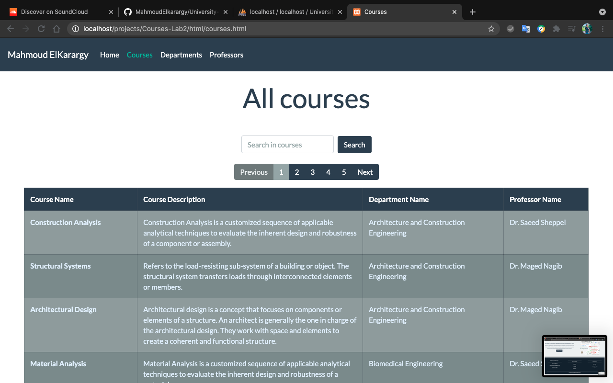
  
Quere Search results are splits into pages.

### Searching

  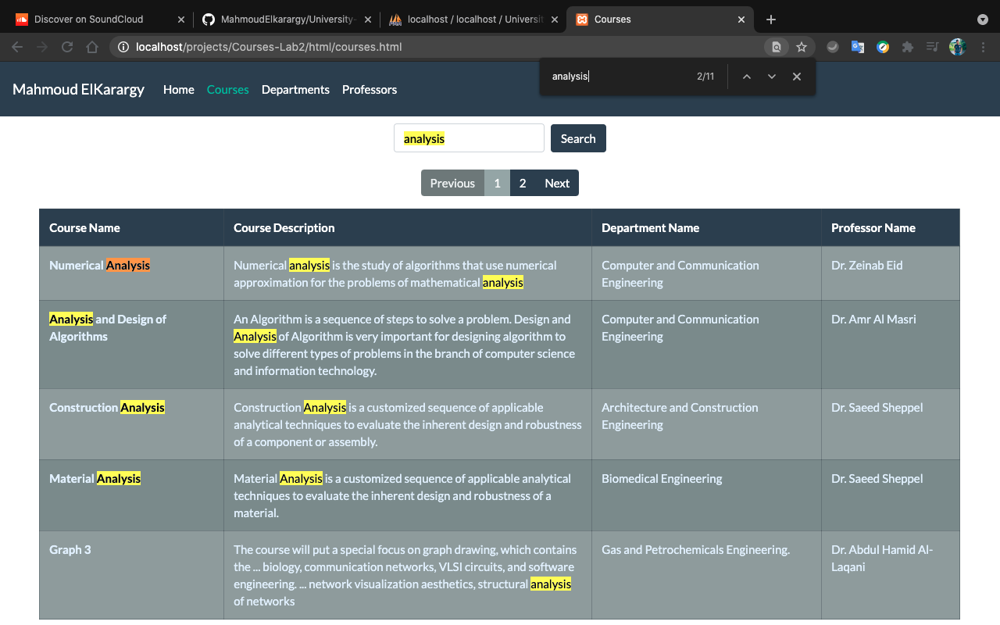
  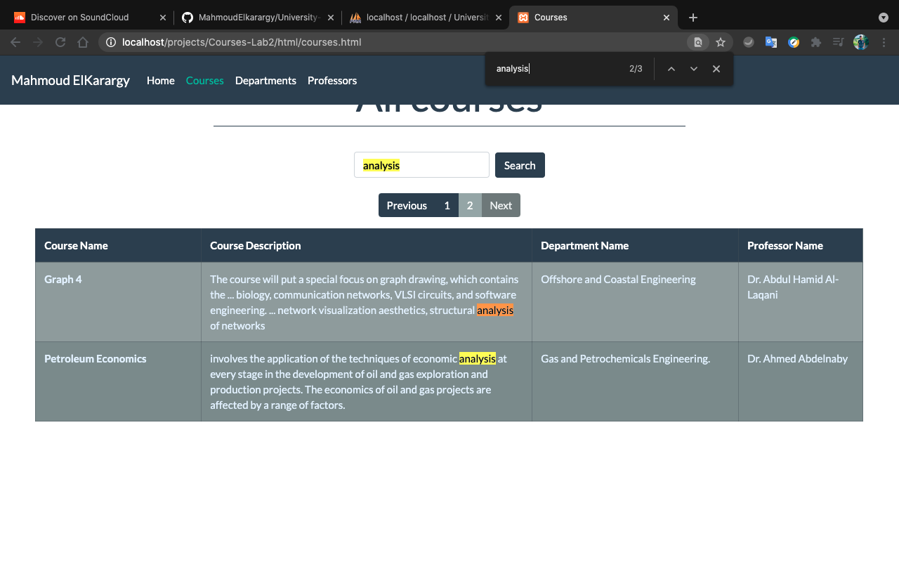
  
Search result return any matching word, Pagination also available

## Departments

  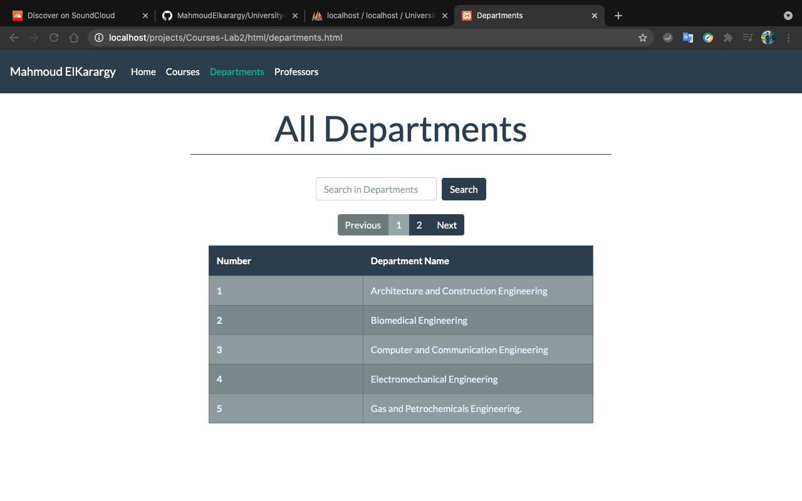

## Professors

  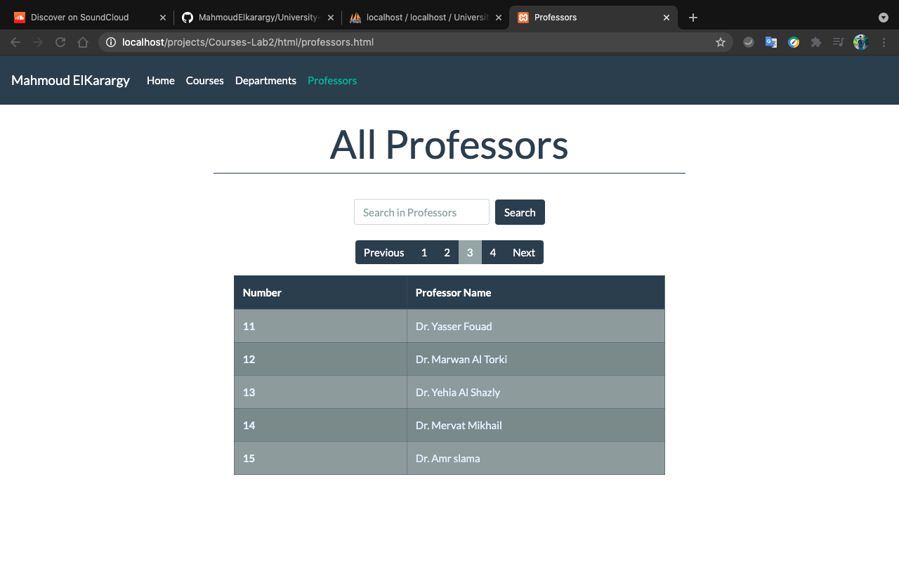

# Technologies used 
* phpMyAdmin. 
* jQuery. 
* Ajax. 
* Bootstrap.
